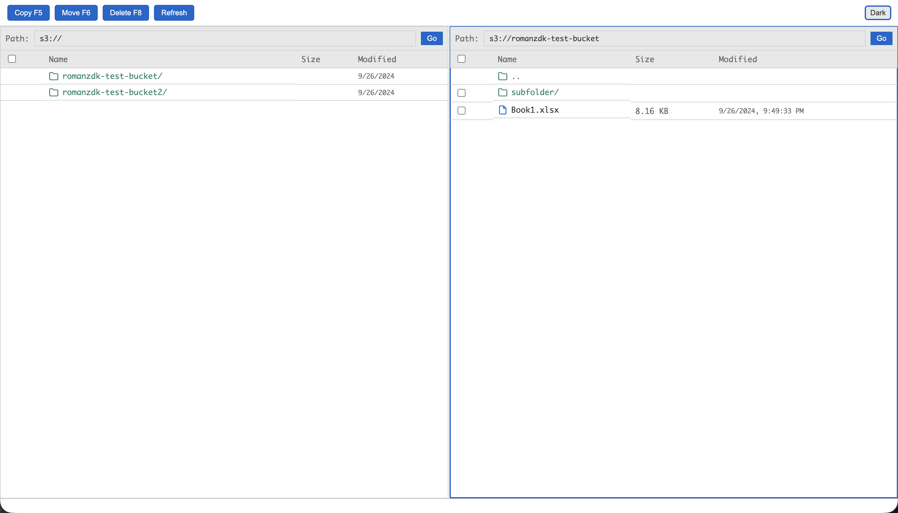
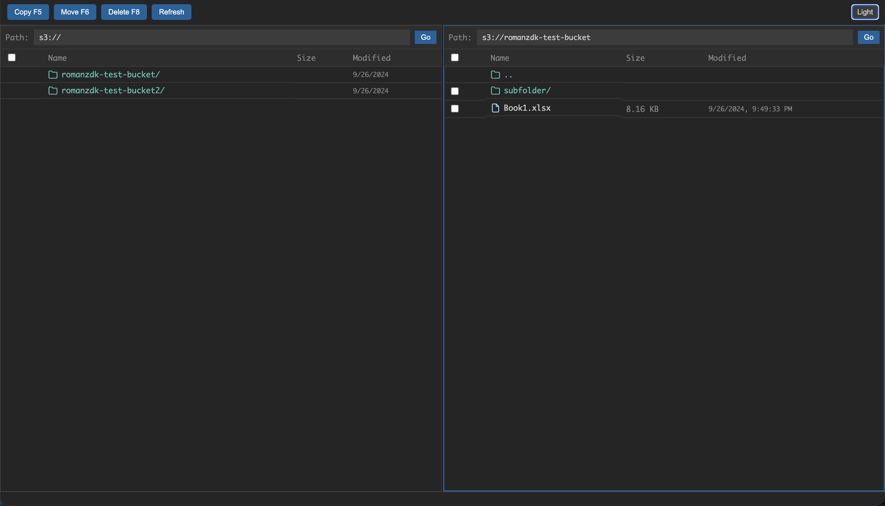

# S3 Commander

[](https://www.python.org/downloads/)
[](https://fastapi.tiangolo.com/)

A Total Commander-style dual-pane file browser for AWS S3. Browse buckets and objects in two side-by-side panes, move and copy files between locations using server-side S3 operations—no download or upload required.






## Features

- 📂 **Two-pane layout** — Navigate different S3 paths in each pane
- ⚡ **Server-side move/copy** — Uses S3 CopyObject + DeleteObject (like `aws s3 mv`), no data transfer through your machine
- 🪣 **Bucket list on startup** — Buckets load automatically when you open the app
- ⌨️ **Keyboard shortcuts** — F5 Copy, F6 Move, F8 Delete
- 🌓 **Dark/light mode** — Theme toggle with preference persistence (saved in localStorage)
- 📁 **Folder and file icons** — Visual distinction for prefixes and objects
- 📋 **Copy path button** — Small button next to each file/folder that copies the full `s3://bucket/key` path to clipboard
- ⏹️ **Cancel operation** — Cancel in-progress copy, move, or delete
- 📊 **Progress bar** — Status bar shows a progress indicator: indeterminate for copy/move/loading, determinate for multi-item delete
- 📍 **Operation status** — Status bar displays source and destination paths during move/copy, and source during delete

## Disclaimer

> ⚠️ **No caching.** Every action in S3 Commander triggers a direct AWS API call—equivalent to using the AWS CLI or SDK. Listing buckets, listing objects, copying, moving, and deleting all hit S3 in real time. There is no local cache, no prefetching, and no offline mode. Each operation incurs the corresponding S3 API usage and costs.

## Requirements

- 🐍 Python 3.10+
- 🔑 AWS credentials via environment variables or IAM role

## Installation

### Using Poetry (recommended)

```bash
git clone https://github.com/romanzdk/s3-commander.git
cd s3-commander
poetry install
```

### Using pip

```bash
pip install .
```

## Configuration

🔧 Provide AWS credentials using one of these methods:

- **Environment variables**: `AWS_ACCESS_KEY_ID`, `AWS_SECRET_ACCESS_KEY`
- **IAM role**: When running on AWS (EC2, ECS, Lambda)
- **AWS config**: `~/.aws/credentials` (when running locally)

Optional: `AWS_REGION` for non-default regions.

## Usage

### Run locally

```bash
poetry run uvicorn s3_browser.main:app --reload
```

Then open http://127.0.0.1:8000

### Run with Docker

```bash
docker build -t s3-commander .
docker run -e AWS_ACCESS_KEY_ID=xxx -e AWS_SECRET_ACCESS_KEY=xxx -p 8000:8000 s3-commander
```

### Basic workflow

1. **Start** — Buckets load automatically in both panes
2. **Navigate** — Click a bucket or folder to enter; click `..` to go up
3. **Path bar** — Type `s3://bucket/prefix/` and press Go to jump directly
4. **Select** — Use checkboxes to select items
5. **Copy (F5)** — Copy selected items to the other pane
6. **Move (F6)** — Move selected items to the other pane (server-side)
7. **Delete (F8)** — Delete selected items
8. **Copy path** — Click the small copy icon next to any file/folder to copy its full S3 path to clipboard
9. **Cancel** — Click Cancel (or let the operation finish) while copy, move, or delete is in progress

### Toolbar

| Button | Action |
|-------|--------|
| Copy F5 | Copy selected items to the other pane |
| Move F6 | Move selected items to the other pane |
| Delete F8 | Delete selected items |
| Refresh | Reload both panes |
| Cancel | Abort the current operation (visible only during copy/move/delete) |
| Light/Dark | Toggle theme |

## Development

```bash
poetry install
poetry run uvicorn s3_browser.main:app --reload --host 127.0.0.1 --port 8000
```

### Project structure

```
s3-commander/
├── s3_browser/
│   ├── main.py       # FastAPI app
│   ├── s3_client.py  # S3 operations (boto3)
│   └── api/
│       └── routes.py # REST endpoints
├── static/
│   ├── index.html
│   ├── style.css
│   └── app.js
├── pyproject.toml
├── Dockerfile
├── .dockerignore
└── .gitignore
```

## Security

- 🔒 No authentication layer — assume behind VPN, reverse proxy, or internal network
- 🔑 Credentials are read from the environment; never hardcode or expose in the UI

## License

MIT License. See [LICENSE](LICENSE) for details.
